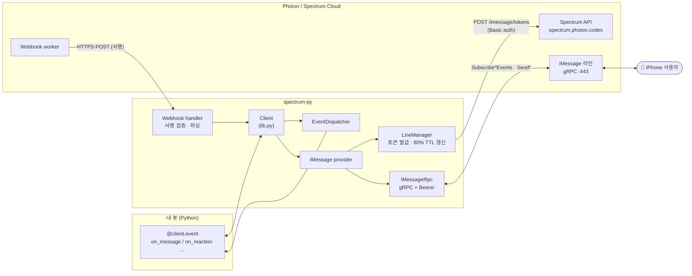
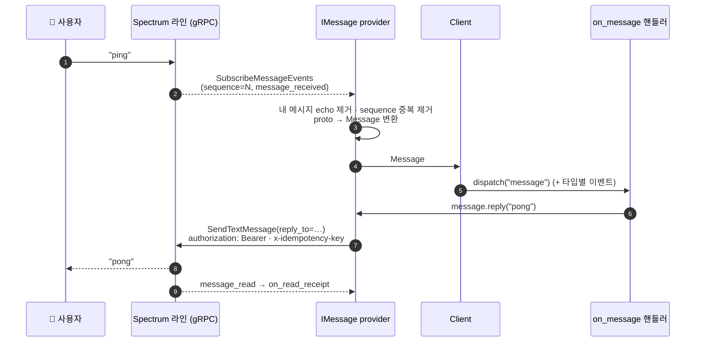
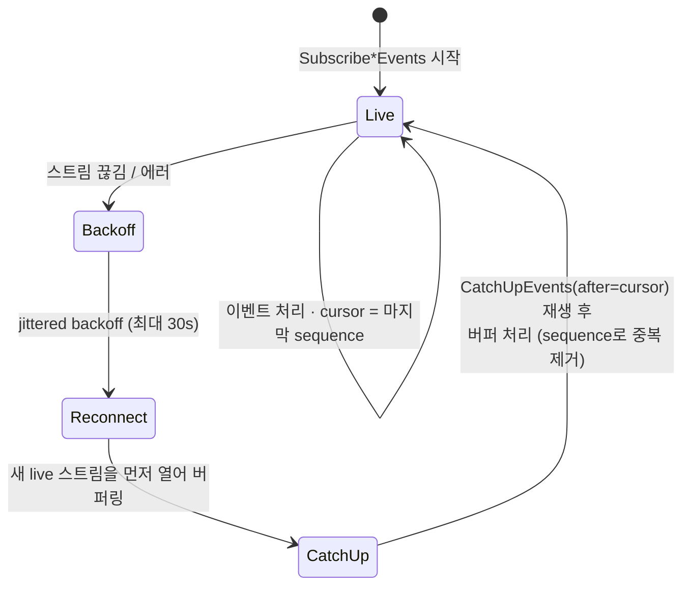
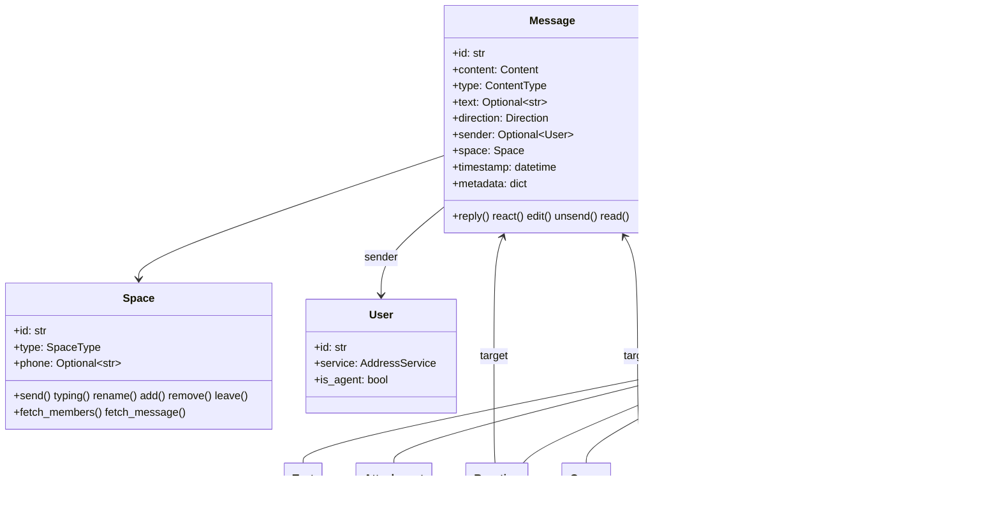
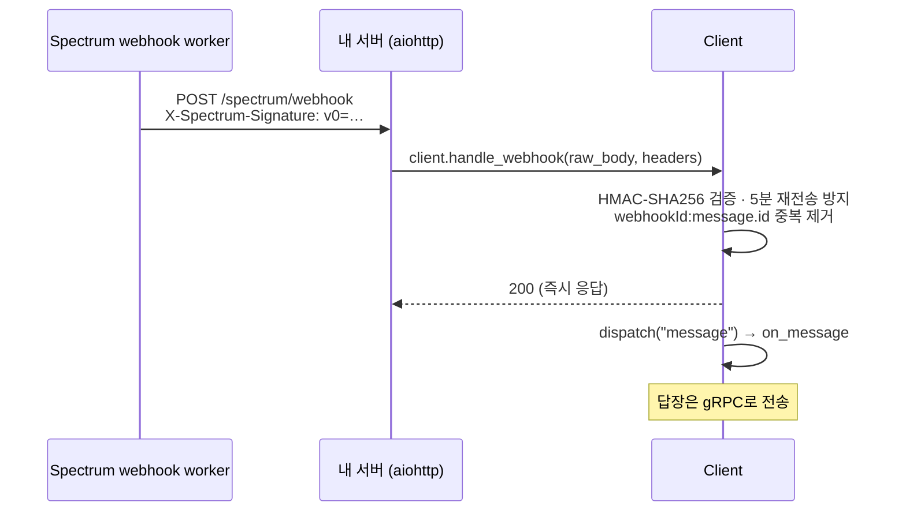
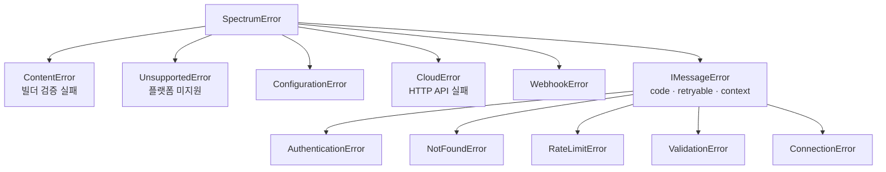

# spectrum-py

[Photon Spectrum](https://photon.codes/docs/spectrum-ts/introduction)용 비동기 Python SDK입니다.
공식 TypeScript SDK인 [`spectrum-ts`](https://github.com/photon-hq/spectrum-ts)를 포팅했고, API는 **discord.py 스타일 이벤트 핸들러**로 구성했습니다.

```python
import spectrum
from dotenv import load_dotenv
from spectrum.providers import IMessage

load_dotenv()
client = spectrum.Client(providers=[IMessage()])

@client.event
async def on_message(message: spectrum.Message):
    if message.text == "ping":
        async with message.space.typing():
            await message.reply("pong")

client.run()
```

- 실제 iMessage 송수신: Spectrum Cloud 라인에 gRPC로 직접 연결
- `asyncio` 기반, `@client.event` / `@client.listen()` / `client.wait_for()`
- `Enum` + `dataclass` 모델, `property` getter/setter
- 연결이 끊겨도 놓친 이벤트를 다시 받아 오고, 같은 이벤트는 한 번만 처리

---

## 목차

- [설치](#설치)
- [설정](#설정)
- [아키텍처](#아키텍처)
- [이벤트](#이벤트)
- [메시지 보내기](#메시지-보내기)
- [모델](#모델)
- [웹훅 모드](#웹훅-모드)
- [Cloud API](#cloud-api)
- [에러 처리](#에러-처리)
- [프로젝트 구조](#프로젝트-구조)
- [제약 사항](#제약-사항)

---

## 설치

Python 3.11 이상이 필요합니다.

```bash
pip install "spectrum-py[dotenv] @ git+https://github.com/deongdion/spectrum"
```

소스에서 설치하는 경우:

```bash
git clone https://github.com/deongdion/spectrum && cd spectrum
python -m venv .venv
.venv/Scripts/pip install -e ".[dotenv]"      # macOS/Linux: .venv/bin/pip
```

| extra | 포함 | 용도 |
|---|---|---|
| `dotenv` | `python-dotenv` | `.env` 로딩 (예제에서 사용) |
| `webhook` | `aiohttp` | 웹훅 수신 서버 헬퍼 |

음성 메모를 m4a가 아닌 형식(wav, mp3 등)으로 보내려면 [ffmpeg](https://ffmpeg.org)가 `PATH`에 있어야 합니다.

## 설정

[대시보드](https://app.photon.codes) → 프로젝트 **Settings**에서 자격 증명을 복사해 `.env`에 넣습니다.

```bash
cp .env.example .env
```

| 변수 | 필수 | 설명 |
|---|---|---|
| `SPECTRUM_PROJECT_ID` | ✅ | 프로젝트 ID (`PHOTON_PROJECT_ID`도 인식) |
| `SPECTRUM_PROJECT_SECRET` | ✅ | 프로젝트 시크릿 (`PHOTON_PROJECT_SECRET`도 인식) |
| `SPECTRUM_WEBHOOK_SECRET` | 웹훅 모드 | 웹훅 등록 시 한 번만 발급되는 서명 시크릿 |
| `SPECTRUM_FFMPEG_PATH` | | ffmpeg 경로 (기본: `PATH`에서 탐색) |

생성자에 직접 값을 넘기면 환경 변수보다 우선합니다: `spectrum.Client(providers=[...], project_id=..., project_secret=...)`

> **Free / Pro 요금제(공유 라인)**: 대시보드 **Users**에 등록한 번호에만 보낼 수 있습니다.
> 등록하지 않은 번호로 보내면 `Target not allowed for this project` 에러가 납니다.
> 그룹 대화 생성과 그룹 이벤트 수신은 Business 요금제(전용 라인)에서만 됩니다.

예제 실행:

```bash
.venv/Scripts/python example.py
```

봇 번호로 `ping` / `party` / `ask` 를 보내 보세요.

---

## 아키텍처



| 라인 종류 | gRPC 주소 | `space.phone` |
|---|---|---|
| 공유 (Free/Pro) | `imessage.spectrum.photon.codes:443` | `"shared"` |
| 전용 (Business) | `{instanceId}.imsg.photon.codes:443` (라인마다) | 라인의 E.164 번호 |

### 메시지 수신 → 답장 흐름



### 재연결과 이벤트 복구



토큰이 갱신될 때 라인 목록도 다시 맞춥니다. 실행 중에 새로 생긴 전용 라인은 스트림이 자동으로 붙고, 사라진 라인은 닫힙니다.

---

## 이벤트

handler 이름이 곧 이벤트 이름입니다. `@client.event`는 이벤트당 하나만 등록되고, `@client.listen("on_x")`로는 여러 개를 등록할 수 있습니다.

| 이벤트 | 인자 | 발생 시점 |
|---|---|---|
| `on_ready()` | | 모든 provider 연결 완료 |
| `on_message(m)` | `Message` | **모든** 수신 메시지 (아래 타입별 이벤트 포함) |
| `on_reaction(m)` | `Message` | 상대가 반응을 남김 (`m.content.target` = 대상 메시지) |
| `on_read_receipt(m)` | `Message` | 상대가 내 메시지를 읽음 (`m.sender` = 읽은 사람) |
| `on_poll(m)` | `Message` | 상대가 투표를 만듦 |
| `on_poll_vote(m)` | `Message` | 투표 / 투표 취소 |
| `on_member_add(m)` / `on_member_remove(m)` / `on_member_leave(m)` | `Message` | 그룹 멤버 변경 (전용 라인) |
| `on_space_rename(m)` / `on_space_avatar(m)` | `Message` | 그룹 이름 / 아이콘 변경 (전용 라인) |
| `on_imessage_raw_event(phone, event)` | `str`, `StreamEvent` | gRPC 원본 이벤트 전부 |
| `on_provider_error(provider, exc)` | | provider 스트림 실패 |
| `on_error(event, exc, *args)` | | 핸들러 예외 (등록하지 않으면 로그로 출력) |
| `on_close()` | | 클라이언트 종료 |

> ⚠️ 읽음 확인·반응도 `on_message`로 들어옵니다. 텍스트만 처리하려면 `message.type`을 확인하세요.

```python
@client.event
async def on_message(message):
    if message.type is not spectrum.ContentType.TEXT:
        return
    ...

# 다음 답장 기다리기
answer = await client.wait_for(
    "message",
    check=lambda m: m.type is spectrum.ContentType.TEXT and m.sender == message.sender,
    timeout=60,
)

# spectrum-ts 스타일 반복도 가능
async for message in client.messages():
    ...
```

### 라이프사이클

| 메서드 | 설명 |
|---|---|
| `client.run()` | 블로킹 실행 (로깅 설정, Ctrl+C 처리) |
| `await client.start()` | `login()` + `connect()` |
| `await client.login()` | 자격 증명 확인, provider 준비 (스트림은 열지 않음 — 웹훅 전용 모드) |
| `await client.connect()` | 스트림을 열고 `on_ready`를 발생시킨 뒤 `close()`까지 대기 |
| `await client.close()` | 스트림 · provider · HTTP 정리 (여러 번 호출해도 안전) |
| `async with client:` | `login()` / `close()` 자동 처리 |

---

## 메시지 보내기

`Space`와 `Message`의 메서드는 모두 `space.send(빌더)`를 간단하게 쓰는 단축 메서드입니다.

```python
await message.reply("pong")                    # 스레드 답장
await message.react(spectrum.Emoji.LAUGH)      # 탭백 반응 → 반환된 Message로 unsend 가능
await message.read()                           # 읽음 처리

await space.send("hello")                      # 문자열 = text()
await space.send("a", "b", "c")                # 순서대로 3개 전송
async with space.typing():                     # 블록이 끝나면(예외 시에도) typing 해제
    ...

sent = await space.send("Draft")
await sent.edit("Final")                       # 15분 이내
await sent.unsend()                            # 2분 이내
```

### 콘텐츠 빌더

```python
from spectrum import (text, markdown, attachment, voice, contact, richlink,
                      app, poll, group, effect, reply, reaction, MessageEffect)

await space.send(markdown("**굵게** _기울임_ ~~취소선~~"))        # UTF-16 서식 범위로 변환
await space.send(attachment("photo.heic"))                         # 경로 / URL / bytes
await space.send(voice("note.wav"))                                # 필요하면 ffmpeg로 m4a 변환
await space.send(effect("생일 축하해!", MessageEffect.CELEBRATION))  # iMessage 효과
await space.send(group(attachment("1.jpg"), attachment("2.jpg")))  # 앨범
await space.send(poll("점심?", "피자", "초밥"))
await space.send(app("https://example.com/order/1"))              # og 태그로 카드 자동 구성
await space.send(text(llm_stream))                                 # 스트리밍: 첫 전송 후 편집으로 갱신
```

빌더는 만드는 순간 입력을 검증합니다. 예를 들어 반응에 다시 반응하거나, 읽음 확인에 답장하거나, 받은 메시지를 `unsend`하거나, 그룹을 중첩하면 바로 `ContentError`가 납니다.

### 대화 시작 · 그룹 관리

```python
im = client.imessage
space = await im.create_space(["+821012345678"])                 # DM
group = await im.create_space(["+8210...", "+8210..."])          # 그룹 (전용 라인)
space = await im.get_space("any;-;+821012345678")                # 기존 대화

await group.rename("주말 모임")
await group.set_avatar("icon.png")
await group.add("+821099998888")
members = await group.fetch_members()
await im.background(space, "wallpaper.jpg")                      # 채팅 배경
await im.share_contact_card(space)                               # 봇 연락처 카드
```

---

## 모델



- 도메인 모델(`Message`, `Space`, `User`, 콘텐츠 26종)은 `@dataclass`로 만들었습니다. 상태는 private 필드에 두고 `@property` getter와 검증하는 setter로 노출합니다.
- API 응답(`ProjectInfo`, `IMessageTokens`, `Webhook` …)은 `frozen dataclass`입니다.
- 열거형은 모두 `StrEnum`이라 문자열과 바로 비교할 수 있습니다: `ContentType.TEXT == "text"`.
- 주요 Enum: `Platform`, `ContentType`, `Direction`, `SpaceType`, `Emoji`, `Tapback`, `MessageEffect`, `AddressService`, `TypingState`.

iMessage 메시지의 `message.metadata`에는 `is_delivered`, `date_read`, `send_error_code`, `native_text`, `mentions`, `attachment_metadata` 같은 원본 정보가 들어 있습니다.

---

## 웹훅 모드

계속 켜 두는 스트림 대신 Spectrum이 HTTPS로 메시지를 보내주는 방식입니다. 서버리스 환경에서 쓸 수 있습니다.



```python
# 1) URL 등록 (시크릿은 한 번만 반환됩니다)
async with spectrum.Client(providers=[IMessage()]) as client:
    reg = await client.cloud.register_webhook("https://your-host/spectrum/webhook")
    print(reg.signing_secret)          # → SPECTRUM_WEBHOOK_SECRET

# 2) 서버 실행 (pip install "spectrum-py[webhook]")
from spectrum.webhook import server
server.run(client, port=8080, path="/spectrum/webhook")
```

다른 프레임워크에서는 raw body와 헤더를 그대로 넘기면 됩니다:
`response = await client.handle_webhook(body_bytes, headers)` → `response.status / .body / .headers`

Spectrum 서명(`v0=`)과 Standard Webhooks(`whsec_…`) 두 방식을 모두 검증합니다.

---

## Cloud API

로그인한 뒤 `client.cloud`로 관리 API를 호출할 수 있습니다 (HTTP Basic, `https://spectrum.photon.codes`).

```python
await client.cloud.get_project()
await client.cloud.create_user("+821012345678")       # 공유 라인 발송 허용 목록
await client.cloud.list_users()
await client.cloud.list_lines()
await client.cloud.list_webhooks()
await client.cloud.rotate_webhook_secret(webhook_id)
```

---

## 에러 처리



```python
from spectrum.providers.imessage import ErrorCode, RateLimitError

try:
    await space.send("hi")
except RateLimitError as e:
    if e.code is ErrorCode.DAILY_LIMIT_EXCEEDED: ...
```

- `retryable=True`인 단일 요청은 SDK가 자동으로 재시도합니다.
- 토큰 만료(`UNAUTHENTICATED`)를 받으면 토큰을 강제로 갱신한 뒤 한 번 더 시도합니다.
- 변경 요청(전송 등)에는 `x-idempotency-key`를 붙여서, 재시도해도 같은 메시지가 두 번 나가지 않습니다.

---

## 프로젝트 구조

```
spectrum/
├── __init__.py          공개 API
├── lib.py               Client — 이벤트, 라이프사이클, 웹훅 진입점
├── core/                errors · config(env) · dispatcher · utils
├── models/              enums · Message · Space · User · content(26종)
├── content/             빌더 · markdown→서식 · vCard · MIME · m4a 변환 · 링크 메타데이터
├── cloud/               Spectrum Cloud HTTP 클라이언트 · 토큰 갱신
├── providers/
│   ├── base.py          Provider 추상 클래스 (spectrum-ts definePlatform 대응)
│   └── imessage/        rpc(gRPC) · lines(토큰/라우팅) · inbound · outbound · provider
│       └── _proto/      photon.imessage.v1 생성 코드
└── webhook/             서명 검증 · payload 파서 · aiohttp 서버
example.py               실행 가능한 iMessage 봇
```

### 새 플랫폼 추가

`Provider`를 상속해서 `send()`와 `stream()`을 구현하면 됩니다. `reply`, `react`, `typing` 같은 동작은 모두 `send(space, content)` 하나로 들어옵니다.

```python
from spectrum.providers import Provider

class MyPlatform(Provider):
    platform = "my_platform"

    async def stream(self):
        async for raw in my_client.listen():
            yield self.make_message(id=raw.id, content=spectrum.models.Text(raw.text),
                                    space=self.make_space(raw.chat_id), timestamp=raw.ts,
                                    sender=self.make_user(raw.author))

    async def send(self, space, content):
        ...
```

---

## 제약 사항

- **WhatsApp Business / Telegram / Slack** provider는 아직 없습니다 (iMessage만 지원).
- 공유 라인: 그룹 생성 · 그룹 이벤트 수신 불가, 등록된 Users에게만 발송.
- 할당량: 서버당 하루 5,000건 발신, 라인당 하루 50개 신규 대화.
- 읽음 확인은 1:1 대화에서만 정확하고, 그룹에서는 best-effort입니다 (Apple 제약).
- 수정은 15분, 회수(unsend)는 2분 이내만 가능합니다 (iMessage 제약).
- 전달성(스팸 판정 회피) 가이드: [iMessage deliverability](https://photon.codes/docs/best-practices/imessage-deliverability)

## 참고

- Spectrum 문서: https://photon.codes/docs
- spectrum-ts: https://github.com/photon-hq/spectrum-ts
- advanced-imessage-ts (gRPC proto 원본): https://github.com/photon-hq/advanced-imessage-ts
