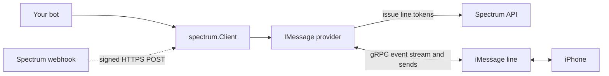

# Spectrum

Async Python SDK for [Photon Spectrum](https://photon.codes/docs/spectrum-ts/introduction) — build agents that talk over iMessage.

```python
import spectrum
from dotenv import load_dotenv
from spectrum.providers import IMessage

load_dotenv()
client = spectrum.Client(providers=[IMessage()])

@client.event
async def on_message(message: spectrum.Message):
    if message.text == "ping":
        await message.reply("pong")

client.run()
```

## Installation

Requires Python 3.11+.

```bash
pip install "spectrum[dotenv] @ git+https://github.com/deongdion/spectrum"
```

Optional extras: `dotenv` (load `.env` files), `webhook` (aiohttp server for webhook mode).
Sending voice notes in formats other than m4a requires [ffmpeg](https://ffmpeg.org) on `PATH`.

## Configuration

Copy `.env.example` to `.env` and fill in the credentials from your project **Settings** on the [dashboard](https://app.photon.codes).

| Variable | Required | Description |
|---|---|---|
| `SPECTRUM_PROJECT_ID` | yes | Project ID (`PHOTON_PROJECT_ID` also works) |
| `SPECTRUM_PROJECT_SECRET` | yes | Project secret (`PHOTON_PROJECT_SECRET` also works) |
| `SPECTRUM_WEBHOOK_SECRET` | webhook mode | Signing secret returned when the webhook is registered |
| `SPECTRUM_FFMPEG_PATH` | no | Path to ffmpeg (defaults to `PATH`) |

Values passed to `spectrum.Client(...)` take precedence over the environment.

> On Free/Pro plans your project uses a **shared line**: you can only message numbers registered under **Users** in the dashboard, and group chats are unavailable. Dedicated lines (Business) lift both restrictions.

Run the example bot, then text the bot's number `help` to list everything it can send (photos, albums, voice notes, maps, polls, effects, streaming text and more):

```bash
python example.py
```

## Running on your own Mac

Instead of Photon's lines, the bot can use the Messages app on a Mac you control: it reads `~/Library/Messages/chat.db` and sends with AppleScript. No Spectrum project is needed.

```python
from spectrum.providers import LocalIMessage

client = spectrum.Client(providers=[LocalIMessage()])
```

- Sign Messages in to the Apple ID the bot should use (an email address works; a phone number needs an iPhone to register it).
- Give the terminal running Python **Full Disk Access**, and allow it to control Messages the first time it sends.
- Supported: text, attachments, voice notes, contact cards, links and inbound tapbacks. Sending tapbacks, edits, unsend, read receipts, typing indicators, effects and group management are not available through AppleScript.

## How it works



- The provider mints short-lived line tokens from the Spectrum API and renews them before they expire.
- Inbound events arrive over a gRPC stream. After a disconnect, missed events are replayed and duplicates are dropped, so each message is handled once.
- Every message sent by the bot carries an idempotency key, so retries never deliver twice.

## Events

Register handlers with `@client.event` (one per event) or `@client.listen("on_...")` (any number).

| Event | Fired when |
|---|---|
| `on_ready()` | Connected and streaming |
| `on_message(message)` | Any inbound message, including the event types below |
| `on_reaction(message)` | Someone reacted to a message |
| `on_read_receipt(message)` | Someone read a message the bot sent |
| `on_poll(message)` / `on_poll_vote(message)` | A poll was created / voted on |
| `on_member_add` / `on_member_remove` / `on_member_leave` | Group membership changed (dedicated lines) |
| `on_space_rename` / `on_space_avatar` | Group name or icon changed (dedicated lines) |
| `on_error(event, exc, *args)` | A handler raised |
| `on_close()` | The client shut down |

Read receipts and reactions also arrive as `on_message`, so check the type when you only want text:

```python
@client.event
async def on_message(message):
    if message.type is not spectrum.ContentType.TEXT:
        return

    if message.text == "ask":
        await message.space.send("What's your name?")
        answer = await client.wait_for(
            "message",
            check=lambda m: m.type is spectrum.ContentType.TEXT and m.sender == message.sender,
            timeout=60,
            consume=True,  # don't also deliver the answer to on_message
        )
        await answer.reply(f"Nice to meet you, {answer.text}!")
```

## Sending messages

```python
await message.reply("pong")                  # threaded reply
await message.react(spectrum.Emoji.LAUGH)    # tapback
await message.read()                         # mark as read

async with message.space.typing():           # typing indicator, cleared even on error
    await message.space.send("Thinking...")

sent = await message.space.send("Draft")
await sent.edit("Final")                     # within 15 minutes
await sent.unsend()                          # within 2 minutes
```

Content builders:

```python
from spectrum import markdown, attachment, voice, effect, group, poll, app, MessageEffect

await space.send(markdown("**bold** _italic_ ~~strike~~"))
await space.send(attachment("photo.heic"))             # path, URL or bytes
await space.send(voice("note.wav"))                    # converted to m4a when needed
await space.send(effect("Happy birthday!", MessageEffect.CELEBRATION))
await space.send(group(attachment("1.jpg"), attachment("2.jpg")))
await space.send(poll("Lunch?", "Pizza", "Sushi"))
await space.send(app("https://example.com/order/1"))   # card built from the page's Open Graph tags
```

Starting conversations and managing groups:

```python
im = client.imessage
dm = await im.create_space(["+15551234567"])
group_chat = await im.create_space(["+15551234567", "+15557654321"])  # dedicated lines only

await group_chat.rename("Weekend plans")
await group_chat.add("+15550001111")
members = await group_chat.fetch_members()
```

## Webhook mode

Instead of keeping a stream open, Spectrum can POST each inbound message to your server.

```python
# Register once; the secret is shown only in this response.
async with spectrum.Client(providers=[IMessage()]) as client:
    registration = await client.cloud.register_webhook("https://your-host/spectrum/webhook")
    print(registration.signing_secret)  # -> SPECTRUM_WEBHOOK_SECRET

# Serve it (pip install "spectrum[webhook]")
from spectrum.webhook import server
server.run(client, port=8080, path="/spectrum/webhook")
```

With another framework, pass the raw body and headers to `await client.handle_webhook(body, headers)` and return its `status`, `body` and `headers`. Deliveries are signature-checked and deduplicated, then dispatched as `on_message`.

## Errors

All exceptions derive from `spectrum.SpectrumError`. Content builders raise `ContentError` on invalid input, and platform limitations raise `UnsupportedError`. iMessage request failures raise `IMessageError` subclasses with a stable `code`:

```python
from spectrum.providers.imessage import ErrorCode, RateLimitError

try:
    await space.send("hi")
except RateLimitError as error:
    if error.code is ErrorCode.DAILY_LIMIT_EXCEEDED:
        ...
```

## Project layout

```
spectrum/
├── lib.py            Client: events, lifecycle, webhook entry point
├── core/             errors, configuration, event dispatcher
├── models/           Message, Space, User, content types, enums
├── content/          builders, markdown, vCard, audio, link previews
├── cloud/            Spectrum API client and token renewal
├── providers/
│   ├── base.py       Provider base class
│   └── imessage/     gRPC client, line routing, inbound/outbound mapping
└── webhook/          signature verification, payload parsing, aiohttp server
```

## Limitations

- iMessage is the only provider so far.
- Default quotas: 5,000 outbound messages per server per day, 50 new conversations per line per day.
- Read receipts are reliable in one-to-one chats; in groups they are best-effort.
- See Photon's [deliverability guide](https://photon.codes/docs/best-practices/imessage-deliverability) before messaging users at scale.
